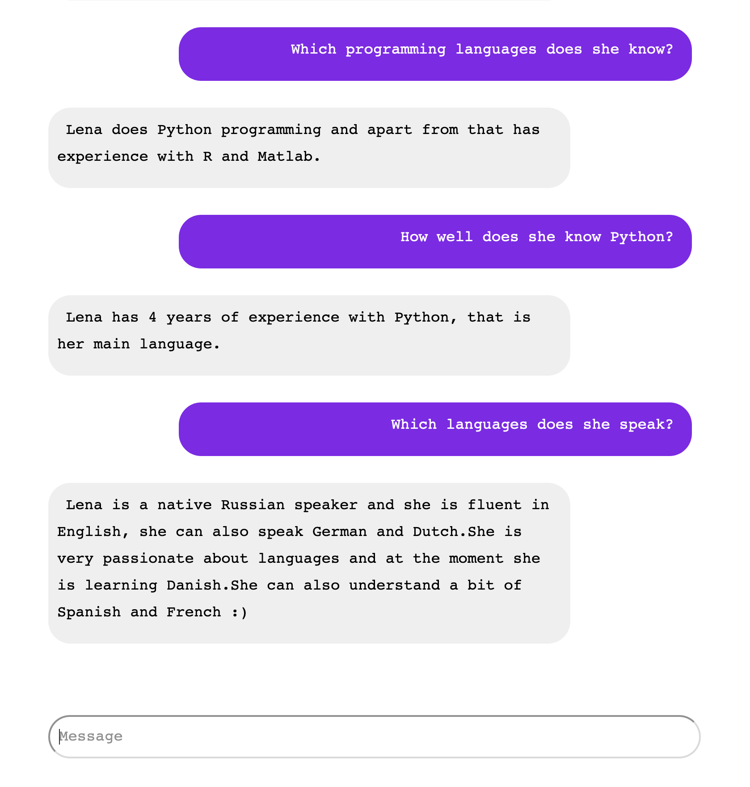

# Resume chatbot built with Python, Flask and DialogFlow

Check out the [demo](http://bot.lenashakurova.ru/)!

## What to do when you have already trained your chatbot in DialogFlow environment and you want to create a Flask app?

If you already have trained your DialogFlow agent and now want to create a simple Web Application that sends requests to your DialogFlow agent, this guide is for you.

#### 0. First things first
- Clone this repo
```
git clone https://github.com/Shakurova/ResumeChatbot.git
```
- Create and set up the environment
```
conda create -n chatbot python=3.6
python setup.py develop
```

#### 1. Get the [Service Account key](https://dialogflow.com/docs/reference/v2-auth-setup)

- Go to **DialogFlow console**, go to settings and in **Google Project** click on **Service Account**. This will bring you to **Google Cloud Platform**.
- Now you need to create a new **Service Account**. Click **Create Service Account**, think of a good Service Account name, as a role choose **DialogFlow API Client**, **create JSON key** and store it in a safe place. Note that you will only be able to download the key once, if you lose it you will have to request a new key.

#### 2. Specify your Google Application Credentials and your Project ID

- First, you need to export the JSON key that you just downloaded. To do so, in your terminal type
```
export GOOGLE_APPLICATION_CREDENTIALS='FULL_PATH_TO_YOUR_JSON_FILE.json'
```
- To connect your application with DialogFlow, you need to pass your **Project ID**. You can find it in your **DialogFlow Console** settings under **Google Project**. Create a config.py file with the following content
```
project_id = 'YOUR_PROJECT_ID'
```

#### 3. Run your app
- Run your Flask app:
```
python __init__.py
```

## Demo
This is how my ResumeBot looks like:
<div align="middle">
  
<br>
  
</div>
